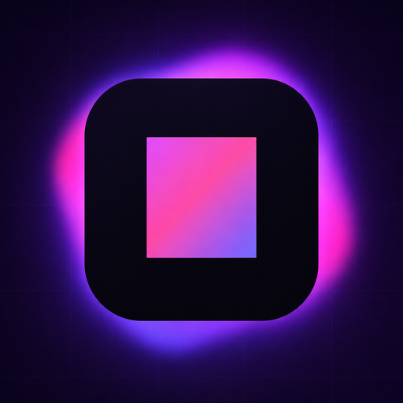

<p align="center">
  
</p>

<h1 align="center">GameStringer</h1>

<p align="center">
  <strong>Application de bureau qui traduit les jeux vidéo dans n'importe quelle langue grâce à l'IA.</strong><br>
  Choisissez un jeu dans votre bibliothèque, sélectionnez une langue, cliquez sur traduire — terminé.
</p>

<p align="center">
  
  
  
  
  
  
</p>

<p align="center">
  <a href="#-quest-ce-que-gamestringer">Présentation</a> ·
  <a href="#-téléchargement">Téléchargement</a> ·
  <a href="#-comment-ça-marche">Comment ça marche</a> ·
  <a href="#-le-prediction-tool-pt">P.T.</a> ·
  <a href="#-moteurs-de-jeu-pris-en-charge">Moteurs</a> ·
  <a href="#-fonctionnalités">Fonctionnalités</a> ·
  <a href="#-compilation-depuis-les-sources">Build</a>
</p>

<p align="center">
  <strong>🌍 Lisez dans votre langue :</strong><br>
  <a href="README.md">🇬🇧 English</a> ·
  <a href="README_IT.md">🇮🇹 Italiano</a> ·
  <a href="README_ES.md">🇪🇸 Español</a> ·
  🇫🇷 Français ·
  <a href="README_DE.md">🇩🇪 Deutsch</a> ·
  <a href="README_PT.md">🇧🇷 Português</a> ·
  <a href="README_JA.md">🇯🇵 日本語</a> ·
  <a href="README_ZH.md">🇨🇳 中文</a> ·
  <a href="README_KO.md">🇰🇷 한국어</a> ·
  <a href="README_RU.md">🇷🇺 Русский</a> ·
  <a href="README_PL.md">🇵🇱 Polski</a>
</p>

---

## Démo

<p align="center">
  
</p>

<p align="center">
  <em>🎮 Bibliothèque de jeux — détection automatique de Steam, Epic, GOG, Origin, Ubisoft, Amazon, itch.io</em>
</p>

<p align="center">
  
</p>

<p align="center">
  <em>🤖 Traducteur IA — 20+ fournisseurs, Quality Badges 0-100, Translation Memory</em>
</p>

<p align="center">
  
</p>

<p align="center">
  <em>🔧 Patcher en un clic — BepInEx, XUnity, UnrealLocres, Bethesda BSA/BA2, CRI CPK, sauvegarde automatique</em>
</p>

<p align="center">
  
</p>

<p align="center">
  <em>💬 Community Chat — Supabase Realtime, salons personnalisés, présence en ligne</em>
</p>

<p align="center">
  
</p>

<p align="center">
  <em>🖥️ System Tray — actions rapides, statut Ollama en direct, sous-menu d'outils</em>
</p>

---

## 🎮 Qu'est-ce que GameStringer ?

GameStringer est une **application de bureau** (Windows et Linux) qui vous permet de traduire les jeux vidéo qui n'existent pas dans votre langue.

La plupart des jeux stockent leur texte dans des fichiers — JSON, XML, CSV, `.locres`, `.rpy`, BSA/BA2, CPK, StringTables d'Unity Localization et beaucoup d'autres formats. GameStringer **scanne le dossier du jeu**, trouve ces fichiers, envoie le texte via un **fournisseur de traduction IA** de votre choix (OpenAI, Claude, Gemini, DeepSeek, Ollama, et 20+ autres) et **applique le texte traduit** dans le jeu. Un clic, aucune connaissance technique requise.

Pour les **jeux Unity** qui verrouillent le texte dans des assets compilés, GameStringer **installe automatiquement BepInEx + XUnity.AutoTranslator** — sans configuration manuelle. Pour les **jeux Bethesda** (Skyrim, Fallout, Starfield), il parse nativement BSA/BA2/ESP. Pour les **jeux CRI Middleware** (Persona, Yakuza), il gère CPK/CRILAYLA/MSG/BMD. Pour **Unreal Engine**, il édite les `.locres` directement.

**Ce n'est pas un site de traduction automatique.** C'est un pipeline complet : **analyse avec P.T. → détection du moteur → extraction du texte → traduction IA → contrôle qualité → application du patch → jouer.**

---

## 📥 Téléchargement

Obtenez la dernière version depuis **[GitHub Releases](https://github.com/rouges78/GameStringer/releases)** :

| Plateforme | Fichier | Notes |
|----------|------|-------|
| **Windows** | `GameStringer-Setup.exe` | Installeur (recommandé) |
| **Windows** | `GameStringer-Portable.zip` | Sans installation |
| **Linux** | `GameStringer.AppImage` | Universel (recommandé) |
| **Linux** | `GameStringer.deb` | Debian / Ubuntu |

**Prérequis :** Windows 10+ ou Linux (Ubuntu 22.04+, Fedora 38+), 4 Go de RAM (8 Go+ pour l'IA locale), 500 Mo de disque. Les versions sont **signées numériquement** et **auto-mises à jour** via Tauri Updater.

---

## 🚀 Comment ça marche

1. **Installez** GameStringer et lancez-le
2. **Votre bibliothèque de jeux se charge automatiquement** — Steam, Epic, GOG, Origin, Ubisoft, Amazon, itch.io (800+ jeux détectés en quelques secondes)
3. **Choisissez un jeu** → lancez éventuellement **P.T. (Prediction Tool)** pour voir la difficulté, le temps estimé, la meilleure chaîne LLM
4. Cliquez sur **« String it! »** — GameStringer scanne, extrait, traduit et applique le patch automatiquement
5. **Jouez dans votre langue** — des sauvegardes sont toujours créées avant le patch

C'est tout. Pas de ligne de commande, pas d'édition manuelle de fichiers, pas d'expérience de modding requise.

---

## 🧠 Le Prediction Tool (P.T.)

> **La fonctionnalité la plus puissante de GameStringer.** Ne commencez pas une traduction à l'aveugle — analysez d'abord.

P.T. est un moteur d'analyse approfondie qui s'exécute *avant* toute traduction. Il scanne le dossier du jeu, détecte le moteur, estime le volume de texte traduisible et vous indique :

- **Difficulty Score 0–100** — poids combiné du volume de chaînes, de la complexité du moteur, du DRM, de l'encodage, des défis linguistiques
- **Temps estimé** sur **18 modèles LLM** — Ollama (Gemma 4, Qwen 3, Llama), OpenAI GPT-4/4o, Claude 3.5, Gemini, DeepL, DeepSeek, Groq
- **5 chaînes LLM recommandées** : Local (confidentialité), Cloud (qualité), Hybrid (équilibrée), Budget, Premium — chacune avec score de coût et qualité
- **Détection DRM** : Denuvo, VMProtect, Steam DRM, EAC, BattlEye — vous avertit avant d'essayer
- **Analyse d'encodage** : Shift-JIS, UTF-8, UTF-16, Big5, EUC-KR détectés fichier par fichier
- **Complexité de traduction** : formes honorifiques, accord de genre, RTL, ruby/furigana, traitement spécifique CJK
- **Score de confiance** et **plan de workflow** — les étapes exactes qui seront exécutées en cliquant sur « String it! »
- **Export du rapport** (JSON + Markdown) pour partage ou archivage

### P.T.Rank — Classement rapide

Après avoir exécuté P.T. sur plusieurs jeux, ouvrez **P.T.Rank** pour voir tous les titres analysés triés par difficulté. Idéal pour planifier votre file de traduction : commencez par les plus faciles, gardez les RPG de 800k chaînes pour la fin.

### Dry Run Scanner

Vous ne voulez pas analyser un jeu à la fois ? Lancez **Dry Run** depuis la page Bibliothèque pour scanner **toute votre bibliothèque Steam (800+ jeux) en lot**, avec **zéro modification de fichier**. Vous obtenez un rapport JSON qui catégorise chaque jeu en **Ready** (moteur supporté + chaînes extractibles), **Errors** (problèmes de manifest / blocage DRM) ou **Unsupported** (moteur inconnu / pas de texte). La progression est en temps réel et aucune sauvegarde n'est nécessaire puisque rien n'est touché.

### String it! Smart Gate

Le bouton **« String it! »** sur la page de détail du jeu est intelligent : si le jeu a déjà été analysé par P.T. dans les dernières 24h, il lance directement l'assistant de traduction. Sinon, il suggère d'exécuter P.T. d'abord (avec le choix en un clic « Run P.T. first » / « String it! anyway »). Plus d'exécutions gaspillées sur des jeux qui s'avèrent verrouillés par DRM ou des affaires de 5 minutes.

---

## 🎯 Moteurs de jeu pris en charge

GameStringer prend en charge **20+ moteurs** avec différents niveaux de profondeur :

| Moteur | Support | Comment ça marche |
|--------|---------|--------------|
| **Unity** | ✅ Complet | Installe automatiquement BepInEx + XUnity.AutoTranslator + pipeline Unity Localization Package (StringTable, SharedTableData, Addressables, Smart Strings) |
| **Unreal Engine** | ✅ Complet | Extraction et patching `.locres` avec UnrealLocres |
| **Unreal _P.pak** | ✅ Complet | Empaquetage du mod en `<GameStringer>_P.pak` chargé via le dossier Paks |
| **Godot** | ✅ Complet | Support natif des fichiers `.translation` |
| **RPG Maker** | ✅ Complet | MV/MZ JSON, VX/Ace via Trans, XP via RMXP |
| **Ren'Py** | ✅ Complet | Parsing natif des scripts `.rpy` avec détection de dialogues |
| **GameMaker** | ⚡ Partiel | Via intégration UndertaleModTool |
| **Telltale** | ✅ Complet | Support `.langdb` / `.dlog` |
| **Wolf RPG** | ✅ Complet | Intégration WolfTrans |
| **Kirikiri** | ✅ Complet | Parsing `.ks` / `.scn` |
| **TyranoScript** | ✅ Complet | Extracteur fast-path avec patching JSON |
| **Electron** | ✅ Complet | Dépaquetage ASAR + détection JSON i18n |
| **Bethesda (Skyrim/Fallout/Oblivion/Starfield)** | ✅ **NEW v1.6.0** | Parser BSA v103-105 + BA2 GNRL/DX10 + ESP/ESM (FULL/DESC/NAM1), STRINGS/DLSTRINGS/ILSTRINGS |
| **CRI Middleware (Persona/Yakuza/Tales of/Dragon Ball)** | ✅ **NEW v1.6.0** | CPK + CRILAYLA + MSG/BMD/FTD avec auto-détection Shift-JIS/UTF-8/UTF-16 |
| **Visionaire Studio** | ✅ Complet | Aventures Daedalic (Deponia, Edna, etc.) |
| **Danganronpa WAD** | ✅ Complet | Parser d'archive WAD + patching des dialogues STX |

> **Les jeux Unity** bénéficient d'un traitement spécial : si aucun fichier traduisible n'est trouvé, GameStringer détecte qu'il s'agit d'un jeu Unity et propose d'**installer automatiquement BepInEx + XUnity.AutoTranslator** en un clic. Il suffit de lancer le jeu une fois après l'installation, puis de re-scanner — tout le texte devient traduisible.
>
> ⚠️ **Avertissement Anti-Cheat** : BepInEx (injection DLL) peut déclencher les systèmes anti-cheat (EAC, BattlEye, Vanguard). GameStringer inclut une détection anti-cheat et vous avertira. **À utiliser uniquement sur des jeux solo / hors ligne.** P.T. détecte le DRM avant toute modification.

---

## ✨ Fonctionnalités

### 🆕 Nouveautés de la v1.8.1

- **Live Translation Overlay** — Traduction en temps réel du jeu avec overlay OCR transparent
- **Hub Marketplace** — Marketplace communautaire de packs de traduction avec installation en un clic
- **Translation Memory Network** — Partage fédéré de traductions de la communauté
- **AI Dubbing Pipeline** — Doublage vocal complet des jeux (STT → Traduire → TTS → Patch)
- **Plugin System** — Plugins de patchers de moteurs de jeu extensibles par la communauté
- **Audit Qualité du Code** — ESLint 1218→20, TypeScript 2427→2, npm audit 39→2 vulnérabilités
- **Performance** — 11 dépendances inutilisées supprimées, imports dynamiques sur les pages lourdes (-86 kB)

### 🤖 Traduction IA

- **20+ fournisseurs** : OpenAI, Claude, Gemini, DeepSeek, Mistral, Groq, DeepL, Ollama (local), LM Studio, TranslateGemma, HY-MT, Qwen 3, NLLB-200, Cerebras, Together AI, Fireworks, OpenRouter, Cohere, Lingva, MyMemory
- **Context-aware** : comprend le genre du jeu, la voix du personnage, le ton, narration vs UI vs dialogue
- **Translation Memory et Glossaire** : cohérence sur tout le projet avec extraction automatique de glossaire
- **Multi-LLM Compare** : exécute plusieurs fournisseurs en parallèle, choisissez le meilleur résultat par chaîne
- **Auto-Select Engine** (NEW v1.7.0) : preset `auto` qui classe dynamiquement les fournisseurs par langue cible + genre du jeu (DeepL pour les européennes, Claude pour CJK, boost basé sur le genre)
- **Quality gates** : score QA automatique sur chaque chaîne traduite (0-100) avec ContentTypeBadge
- **Vision LLM Translator** : utilise des captures en jeu pour le contexte (Ollama, Gemini, GPT-4o)
- **Live Quality Preview** : voyez les scores de qualité en temps réel pendant la traduction par lot
- **Support RTL** : détection automatique de direction et gestion de l'attribut `dir`

### 🧠 P.T. — Prediction Tool (v1.6.0)

- **Difficulty Score 0-100** avec facteurs pondérés (volume, moteur, DRM, encodage, complexité)
- **Estimations de temps pour 18 modèles LLM** incluant Gemma 4 (27B MoE A4B / E4B / E2B)
- **5 chaînes LLM** (Local / Cloud / Hybrid / Budget / Premium) avec estimations de coût et qualité
- **Détection DRM / Anti-Cheat** (Denuvo, VMProtect, Steam DRM, EAC, BattlEye, Vanguard)
- **Analyse d'encodage** fichier par fichier (Shift-JIS, UTF-8/16, Big5, EUC-KR)
- **Analyse de complexité de traduction** (honorifiques, genre, CJK, ruby, RTL)
- **P.T.Rank / Quick Ranking** — trie tous les jeux analysés par difficulté
- **Dry Run Scanner** — scan par lot de toute la bibliothèque Steam (800+ jeux) sans modification
- **Workflow Orchestrator** — moteur d'exécution réel avec fast path universel pour 6+ moteurs et progression en temps réel
- **Cache de prédiction** (24h) — réouverture instantanée des jeux déjà analysés
- **Export du rapport** (JSON + Markdown) pour partage et archivage

### 📚 Bibliothèque de jeux

- **Auto-detect** : Steam (avec Family Sharing), Epic, GOG Galaxy, Origin/EA, Ubisoft Connect, Amazon Games, itch.io
- **800+ jeux** reconnus depuis les bibliothèques installées en quelques secondes
- **Cartes de jeux** avec jaquettes, métadonnées, badge moteur, badge VR, statut d'installation
- **Actions rapides au survol** : String it!, Batch, Community, P.T. — toutes en un clic
- **Game Update Tracker** : détecte quand Steam met à jour un jeu traduit (via `buildid`), vérifie l'intégrité du patch (fichiers BepInEx, présence de `_P.pak`), avertit si un re-patch est nécessaire
- Bouton **« Stop monitoring »** pour arrêter le suivi d'un jeu spécifique

### 🔧 Outils de traduction

- **One-Click Translate** (« String it! ») : scan → traduction → patch en un seul flux
- **Batch Translation** : traduisez des jeux ou dossiers entiers d'un coup
- **Traducteur de sous-titres** : SRT, VTT, ASS/SSA avec préservation du timing
- **OCR Translator** : extrait le texte de jeux rétro (presets 8-bit, 16-bit, DOS) avec vrai backend Tauri Tesseract
- **Voice Pipeline** : speech-to-text → traduction → text-to-speech avec **Duration Matching** (NEW v1.7.0) — ajuste automatiquement la vitesse pour correspondre à la durée de l'audio original
- **Lip Sync** (NEW v1.7.0) : intégration Rhubarb pour la génération de visèmes, export pour Unity/Unreal
- **Gridly CSV Export/Import** (NEW v1.7.0) : format multi-langue compatible avec Gridly/Lokalise/Crowdin
- **Overlay temps réel** : voyez les traductions pendant que vous jouez via VR/screen overlay
- **Auto-Translate Review** : bouton « Translate all untranslated » avec barre de progression
- **Lore Assistant** : chat RAG qui connaît le lore et les dialogues du jeu
- **Character Voice Profiles** : définissez personnalité, ton, manière de parler par personnage
- **Translation Confidence Heatmap** : vue d'ensemble visuelle de la qualité de toutes les traductions

### 🎮 Patchers de moteurs de jeu

- **Unity** : auto-installeur BepInEx + XUnity.AutoTranslator, Unity Localization Package (StringTable, SharedTableData, catalogue Addressables, validateur Smart Strings)
- **Unreal Engine** : extraction `.locres` + empaquetage mod `_P.pak`
- **Bethesda Engine Patcher** (NEW v1.6.0) : Skyrim LE/SE/AE, Fallout 3/NV/4, Oblivion, Starfield — BSA v103-105 + BA2 GNRL/DX10 + ESP/ESM (FULL/DESC/NAM1)
- **CRI Middleware Patcher** (NEW v1.6.0) : Persona 5 Royal, Yakuza, Tales of, Dragon Ball — CPK + CRILAYLA + MSG/BMD/FTD
- **Ren'Py**, **RPG Maker**, **Godot**, **GameMaker**, **Kirikiri**, **Wolf RPG**, **Telltale**, **Visionaire**, **Danganronpa WAD** — tous avec parsers natifs
- **Wizard Stepper** : UI multi-étapes partagée pour tous les patchers
- **Universal PO Export** (gettext `.po`) pour chaque patcher avec métadonnées projet/langue/source/moteur
- **Sauvegarde automatique** : avant chaque patch, avec restauration en un clic

### 🔌 Avancé

- **Auto-Hook Scanner** : scan de la mémoire de processus (Windows WinAPI) pour chaînes hardcoded
- **System Monitor** : usage VRAM/RAM en temps réel pour la planification LLM local
- **Ollama Setup Wizard** : installation pas à pas de l'IA locale
- **Ollama Manager** : auto-discovery des modèles depuis le registre ollama.com + auto-refresh au focus/navigation
- **Debug Console** : console intégrée avec interception de logs
- **Video Extractor** (v1.7.0) : extraction et conversion de vidéo FMV depuis des jeux rétro/modernes avec upscaling IA
- **Plugin System** : document de conception pour plugins tiers (voir `PLUGIN_SYSTEM.md`)
- **Community Hub** : partagez et téléchargez des translation memories + intégration GitHub Discussions
- **Public API v1** : endpoints REST pour l'intégration (`/api/v1/translate`, `/api/v1/batch`)

### 💬 Community Chat

- **Chat en temps réel** avec d'autres traducteurs via Supabase Realtime
- **4 salons par défaut** : General, Translations, Feedback & Bugs, Announcements
- **Salons personnalisés** : créez des salons pour des jeux ou projets spécifiques
- **Auto-Bridge Auth** : votre profil GameStringer se synchronise automatiquement avec Supabase — aucune connexion supplémentaire
- **Présence en ligne** : voyez qui est en ligne dans chaque salon
- **Répondre / modifier / supprimer** les messages avec ownership imposé par RLS
- **Widget drawer extensible** dans le coin inférieur droit

### ♿ Accessibilité (v1.6.0)

- **WCAG 2.1 AA sweep** — `aria-label` sur les boutons icône, en-têtes sémantiques `CardTitle`, `focus-visible` sur toutes les primitives, lien skip-to-content, landmark `main`, helpers `sr-only` en italien
- **`prefers-reduced-motion`** respecté dans toutes les animations
- **`forced-colors`** (mode Contraste élevé Windows) respecté
- **UI en 11 langues** : IT, EN, ES, FR, DE, JA, ZH, KO, PT, RU, PL
- **Support du layout RTL** avec détection automatique de direction

### 🎨 Design System (v1.6.0)

- **Variantes Card** via `cva` : default, muted, highlight, success, error, warning
- **Tailles de Button** incluant `xs` et `icon-sm`
- **Utilitaires de texte** : `text-micro` (9px), `text-2xs` (10px) — plus de valeurs Tailwind arbitraires
- **Radix UI unifié** : 37 fichiers migrés de `@radix-ui/react-*` vers `radix-ui`, 27 paquets supprimés
- **Bundle optimisé** : `optimizePackageImports` pour radix-ui, framer-motion, recharts, cmdk

### 🖥️ App

- **Mises à jour automatiques signées** : mise à jour en un clic depuis l'application via Tauri Updater
- **Profils** : plusieurs profils utilisateur avec clés de récupération
- **Global Hotkeys** : `Ctrl+Shift+T` OCR, `Ctrl+Shift+Q` Quick Translate, `Ctrl+Alt+O` Overlay, `Alt+T` bascule XUnity
- **System Tray** : actions rapides, statut Ollama en direct, sous-menu d'outils
- **Cross-platform** : Windows et Linux avec builds natifs
- **Correctif tray Windows** : empêche la boucle de flash console au spawn des processus enfants

---

## 🔧 Fournisseurs IA

| Fournisseur | Clé API | Free Tier | Idéal pour |
|----------|---------|-----------|----------|
| **Ollama** | Non (local) | ✅ Illimité | Confidentialité, hors ligne |
| **LM Studio** | Non (local) | ✅ Illimité | Confidentialité, modèles GGUF |
| **TranslateGemma** | Non (Ollama) | ✅ Illimité — 55 langues, Google | **Démarrage recommandé** |
| **HY-MT1.5** | Non (Ollama) | ✅ Illimité — ~1 Go RAM, Tencent | Machines à faible RAM |
| **Qwen 3** | Non (Ollama) | ✅ Illimité — multilingue | Langues CJK |
| **Gemma 4** | Non (Ollama) | ✅ Illimité — 27B MoE A4B/E4B/E2B | Qualité locale |
| **Gemini** | Oui | ✅ Free tier (15 RPM) | **Cloud recommandé** |
| **DeepSeek** | Oui | ✅ $0.14/1M input | Cloud économique |
| **Groq** | Oui | ✅ 14 400 req/jour | Rapidité |
| **Mistral** | Oui | ✅ Free tier | Cloud UE |
| **OpenAI** | Oui | Payant | Qualité GPT-4o |
| **Claude** | Oui | Payant | Nuance, contexte long |
| **DeepL** | Oui | ✅ 500k caractères/mois | Langues européennes |
| **MyMemory** | Non | ✅ Illimité | Fallback |
| **Lingva** | Non | ✅ Illimité | Miroir Google MT |
| **Cerebras** | Oui | ✅ Free tier | Rapidité |
| **Together AI** | Oui | ✅ $25 de crédit gratuit | Modèles ouverts |
| **Fireworks** | Oui | ✅ Free tier | Modèles ouverts |
| **OpenRouter** | Oui | ✅ Modèles gratuits | Variété de modèles |
| **NLLB-200** | Oui | ✅ 200 langues | Langues rares |
| **Cohere** | Oui | ✅ Essai gratuit | RAG |

**Recommandés pour démarrer** : **TranslateGemma** via Ollama (gratuit, local, 55 langues) ou **Gemini** (free tier, cloud). Faible RAM : **HY-MT1.5** (~1 Go). Meilleure qualité : **Claude 3.5** ou **GPT-4o**. Meilleur CJK : **Qwen 3**.

---

## 📖 Documentation

### Guides utilisateur (11 langues)

| | | |
|---|---|---|
| 🇮🇹 [Italiano](docs/GUIDA_UTENTE.md) | 🇬🇧 [English](docs/USER_GUIDE_EN.md) | 🇪🇸 [Español](docs/USER_GUIDE_ES.md) |
| 🇫🇷 [Français](docs/USER_GUIDE_FR.md) | 🇩🇪 [Deutsch](docs/USER_GUIDE_DE.md) | 🇯🇵 [日本語](docs/USER_GUIDE_JA.md) |
| 🇨🇳 [中文](docs/USER_GUIDE_ZH.md) | 🇰🇷 [한국어](docs/USER_GUIDE_KO.md) | 🇧🇷 [Português](docs/USER_GUIDE_PT.md) |
| 🇷🇺 [Русский](docs/USER_GUIDE_RU.md) | 🇵🇱 [Polski](docs/USER_GUIDE_PL.md) | |

### Documentation du projet

- **[CHANGELOG.md](CHANGELOG.md)** — historique complet des versions
- **[docs/VERSIONING.md](docs/VERSIONING.md)** — politique de versioning
- **[docs/PROJECT_STATUS.md](docs/PROJECT_STATUS.md)** — feuille de route actuelle
- **[PLUGIN_SYSTEM.md](PLUGIN_SYSTEM.md)** — conception de l'architecture des plugins
- **[LICENSE](LICENSE)** — Source-Available License v1.1

---

## 🛠️ Compilation depuis les sources

**Prérequis** : Node.js 18+, Rust 1.70+, npm. Sous Linux aussi : `libwebkit2gtk-4.1-dev`, `libayatana-appindicator3-dev`, `librsvg2-dev`.

```bash
git clone https://github.com/rouges78/GameStringer.git
cd GameStringer
npm install
npm run dev          # développement
npm run tauri:build  # build de production
```

Backend Rust : `cd src-tauri && cargo check` pour vérifier que les commandes Tauri compilent sur votre plateforme.

---

## 💖 Support

Si GameStringer vous a aidé à jouer dans votre langue :

<p align="center">
  <a href="https://buymeacoffee.com/gamestringer">
    
  </a>
  <a href="https://ko-fi.com/gamestringer">
    
  </a>
  <a href="https://github.com/sponsors/rouges78">
    
  </a>
</p>

---

## 📜 Licence

**Source-Available License v1.1** — le code source est public et vous pouvez le compiler vous-même, mais ce n'est pas « Open Source » approuvé OSI.

- ✅ Gratuit pour un usage personnel
- ✅ Libre d'inspecter, compiler et modifier pour vous-même
- ❌ L'usage commercial nécessite une permission écrite
- ❌ La redistribution de versions modifiées nécessite une permission écrite

Voir [LICENSE](LICENSE) pour les détails. Des questions ? Ouvrez une [Discussion](https://github.com/rouges78/GameStringer/discussions).

---

## 🙏 Credits

- **[BepInEx](https://github.com/BepInEx/BepInEx)** — framework de modding Unity (BepInEx Team)
- **[XUnity.AutoTranslator](https://github.com/bbepis/XUnity.AutoTranslator)** — framework de traduction Unity (bbepis)
- **[UnrealLocres](https://github.com/akintos/UnrealLocres)** — parser Unreal `.locres` (akintos)
- **[UndertaleModTool](https://github.com/krzys-h/UndertaleModTool)** — modding GameMaker (krzys-h)
- **[Tauri](https://tauri.app)** — framework pour applications desktop
- **[Tesseract.js](https://github.com/naptha/tesseract.js)** — moteur OCR
- **[Ollama](https://ollama.com)** — runtime LLM local
- **[Supabase](https://supabase.com)** — backend temps réel pour la Community Chat

---

<p align="center">
  Fait avec ❤️ pour les joueurs qui veulent jouer dans leur propre langue<br>
  <strong>GameStringer v1.8.1</strong> · © 2025-2026 GameStringer Team
  <strong>GameStringer v1.7.0</strong> · © 2025-2026 GameStringer Team
</p>
